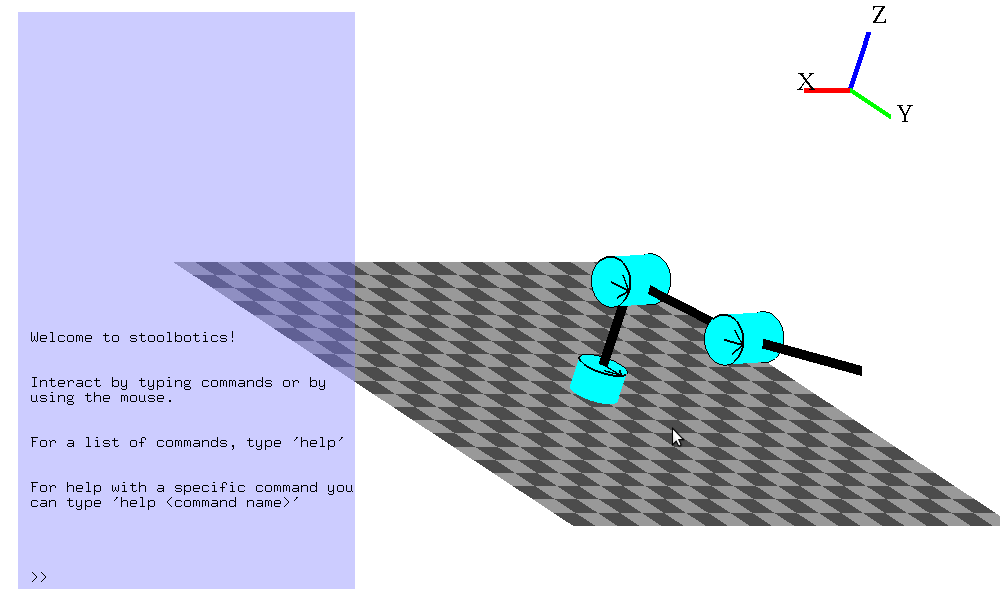

#Introduction
##Welcome

Hello and welcome to the Stoolbotics documentation! Stoolbotics is a general purpose robotic arm and kinematics simulator aimed at being a teaching tool for aspiring roboticists. The motivation for this project was simple: the linear algebra and mathematical concepts behind robotics is difficult for a beginner to understand without any visual context. This is especially true for people who are primarily visual learners.

This tool will hopefully fill a gap in many higher education robotics classrooms. It was designed to be easy to use, compatible with other technologies (like MATLAB). The project itself was conceived halfway through the Fall 2011 semester at RPI by Lucas Doyle, and the implementation was carried out by Lucas Doyle and Scott Peck.

##Features

Stoolbotics has many features that make it attractive to the aspiring roboticst and robotics professor. To name a few:

- Easy to use file format for specifying a robot arm
- Ability to visualize any robot that can be specified in such a file
- Compute the forward kinematics of any robot
- Animate and draw paths for robots
- Command line interface within simulator with many useful commands
- Completley customizable simulation environment (timestepping, etc)
- Ability to record simulator activity
- Ability to playback saved recordings, or even import a recording generated in MATLAB
- Change variables in the simulator on the fly
- Built in help from simulator command line, and of this stellar documentation
- Cross platform

##Getting Stoolbotics
###For Windows
####Prebuilt (reccomended)

Stoolbotics comes in a pre-packaged, portable build for Windows. You can download it from Lucas' Dropbox here: [http://dl.dropbox.com/u/4428042/simulator.zip](http://dl.dropbox.com/u/4428042/simulator.zip).

Simply unzip and run stoolbotics.bat, and you should be up and running!

####From Source
If you're feeling more adventerous, or want to develop stoolbotics for Windows, you can still run the simulator through python. You will need to install a few dependencies though. You will need to have python (2.7 works best), numpy, PyOpenGL and (optionally) the python imaging library (PIL) installed. If you choose not to install PIL, the only functionality that will be effected is the ability to take screenshots from within the simulator.

Once you have everything above installed, you should [download the latest zip](https://github.com/Stonelinks/Stoolbotics/zipball/master) of our code repository. Once you have it downloaded, just unzip and run <code>python simulator.py</code> in the simulator directory.

###For Linux

Make sure you have Python, git, numpy, PyOpenGL and (optionally) the python imaging library (PIL) installed. If you choose not to install PIL, the only functionality that will be effected is the ability to take screenshots from within the simulator.

Make a clone of our repository by running <code>git clone https://github.com/Stonelinks/Stoolbotics.git</code>, then just run <code>sh stoolbotics.sh</code> to fire up the simulator.

###For Mac OSX

OSX isn't officially supported as we don't have a machine we can test on, but if you have a python installation with PyOpenGL, numpy, and PIL then there is no reason why following the Linux instructions above wouldn't work.

If you just want to grab a copy of the code, you can [download the latest zip](https://github.com/Stonelinks/Stoolbotics/zipball/master) of our code repository.

##Quickstart

When you fire up the simulator for the first time, you should see something like what is shown below.

